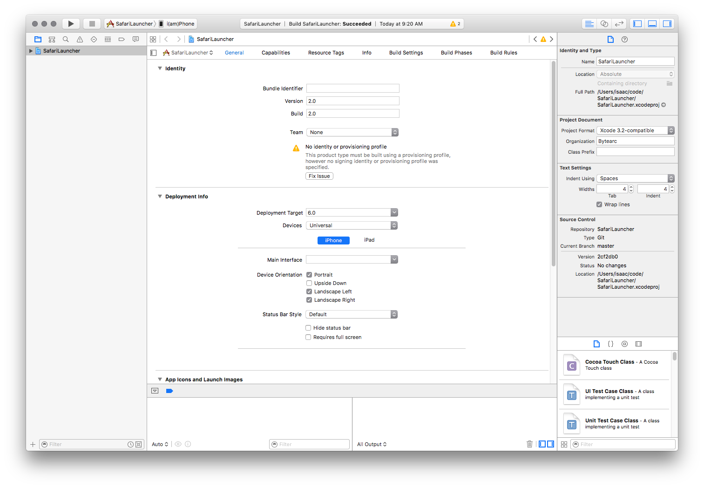
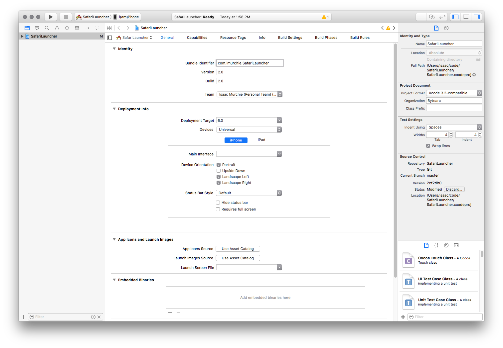

## SafariLauncher Setup Instructions

Running mobile web tests on iOS real devices with iOS 9.3 or below, using Instruments,
requires the introduction of a third-party app, [SafariLauncher](https://github.com/snevesbarros/SafariLauncher).
This is necessary because with Instruments there is no way to start the Safari
app on the device. The `SafariLauncher` app just launches, and then launches
Safari. Simple!

In some configurations, Appium is able to automatically build, sign, and install
`SafariLauncher` as it needs, and there is nothing else necessary to be done. If,
however, this is not the case, as is more often so with later versions of
[Xcode](https://developer.apple.com/xcode/), the following configuration needs to
be done before Safari tests on real devices can be successfully run.


### Automatic SafariLauncher configuration

The only thing needed for automatic `SafariLauncher` configuration is to create
a **provisioning profile** that can be used to deploy the `SafariLauncher` App.
This requires, in particular, a wildcard certificate, which is not possible if
your Apple developer account is a free one. If that is the case, skip to the
manual configuration below.

To create a profile for the launcher go into the **Apple Developers Member Center** and:

  * **Step 1:** Create a **new App Id** and select the WildCard App ID option and set it to "*"
  * **Step 2:** Create a **new Development Profile** and for App Id select the one created in step 1.
  * **Step 3:** Select your **certificate(s) and device(s)** and click next.
  * **Step 4:** Set the profile name and **generate the profile**.
  * **Step 5:** Download the profile and open it with a text editor.
  * **Step 6:** Search for the **UUID** and the string for it is your **identity code**.

Now simply include your UDID and device name in your desired capabilities:
```js
{
  udid: '...',
  deviceName: '...',
  platformName: 'iOS',
  platformVersion: '9.3',
  browserName: 'Safari'
}
```


### Manual SafariLauncher configuration

**Note:** This procedure assumes you have [Xcode](https://developer.apple.com/xcode/) 7.3 or 7.3.1.

It is possible to use the version of [SafariLauncher](https://github.com/snevesbarros/SafariLauncher)
that comes with the [appium-ios-driver](https://github.com/appium/appium-ios-driver),
but if you do, each time you update Appium the procedure will have to be done again.

To get a local copy of `SafariLauncher`, first clone it from [GitHub](https://github.com/):
```bash
git clone https://github.com/snevesbarros/SafariLauncher.git
```

Once you have a local copy of the source code for the `SafariLauncher` app, open
[Xcode](https://developer.apple.com/xcode/) and then open the `SafariLauncher` project


In the `SafariLauncher` target pane you will see an error, saying that there needs
to be a provisioning profile for this app



In order to fix this, you first need to enter a "Bundle Identifier" for the app. The default
expected by Appium is `com.bytearc.SafariLauncher`, but this might not be available
for you to build. In that case, choose something else, and make note of it. Then
choose a "Team", and allow the provisioning profile to be created



Finally, make sure your device is connected to the computer, and choose it as the
target


And run the build and install actions to compile the app and push it onto your
device


Now you have a working `SafariLauncher` on your device. The app itself is a plain
screen that will launch `Safari` at the click of a button


The last step is only necessary if you chose a bundle identifier for the app that
is different from the default (`com.bytearc.SafariLauncher`). If you did, it is
necessary to send that to Appium when creating a session, using the `bundleId`
desired capability:
```js
{
  udid: '...',
  deviceName: '...',
  platformName: 'iOS',
  platformVersion: '9.3',
  browserName: 'Safari',
  bundleId: 'com.imurchie.SafariLauncher'
}
```
